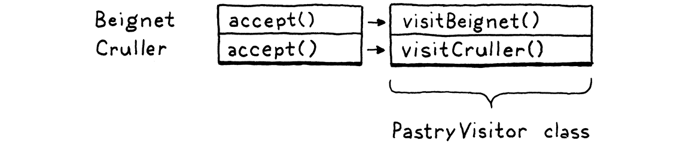

#### Lox Grammar

expression -> literal | unary | binary | grouping ;
literal -> NUMBER | STRING | "true" | "false" | "nil" ;
grouping -> "(" expression ")" ;
unary -> ( "-" | "!" ) expression ;
binary -> expression operator expression ;
operator -> "==" | "!=" | "<" | "<=" | ">" | ">=" | "+" | "=" | "*" | "/" ;
- ONe extra metasyntax here -> In addition to quoted strings for terminals that match exact lexemes, we CAPITALIZE terminals that are single lexeme whose text representation may vary. NUMBER is any number literal, and STRING is any string literal. 
- This will be done the same for IDENTIFIER

#### Implmenting Syntax Trees
- Grammar is recursive––note how `grouping` , `unary`, and `binary` all refer back to `expression`––our data structure will form a tree. 
- Given this structure represents the syntax of our langauge, it's called a `syntax tree`
- In particular, we're defining an `abstract syntax tree (AST)`. In a `parse tree`, every single grammar production becomes a node in the tree. An AST elides productions that aren't needed by later phases.
- The scanner used a single Token class to represent all kinds of lexemes. To distinguish the different kinds––think the number 123 versus the string "123"––we included a simple TokenType enum. Syntax trees are not so homogeneous. Unary expressions have a single operand, binary expressions have two and literals have none.
- We define a base class for expressions. Then, for each kind of expression––each production under `expression`––we create a subclass that has fields for the nonterminals specific to that rule. 
```
abstract class Expr { 
  static class Binary extends Expr {
    Binary(Expr left, Token operator, Expr right) {
      this.left = left;
      this.operator = operator;
      this.right = right;
    }

    final Expr left;
    final Token operator;
    final Expr right;
  }

  // Other expressions...
}
```
- Expr is the base class that all expression classes inherit from. As you can see from Binary, the subclasses are nested inside of it. 
##### Disoriented objects
- You’ll note that, much like the Token class, there aren’t any methods here. It’s a dumb structure. Nicely typed, but merely a bag of data. This feels strange in an object-oriented language like Java. Shouldn’t the class do stuff?

- The problem is that these tree classes aren’t owned by any single domain. Should they have methods for parsing since that’s where the trees are created? Or interpreting since that’s where they are consumed? Trees span the border between those territories, which means they are really owned by neither.

- In fact, these `types exist to enable the parser and interpreter to communicate`. That lends itself to `types that are simply data with no associated behavior`. This style is very natural in functional languages like Lisp and ML where all data is separate from behavior, but it feels odd in Java.

##### Working with Trees
- We have a family of classes and we need to associate a chunk of behavior with each one. 
- The natural solution in an object-oriented language like Java is to put those behaviors into methods on the classes themselves. 
- We could add an abstract `interpret()` method on Expr which each subclass would then implement to interpret itself.
- Check Interpreter Pattern 
- This works alright for tiny projects, but it scales poorly. As these trees spans a few domains. 
- As both the parser and interpreter will mess with them. As you’ll see later, we need to do name resolution on them. If our language was statically typed, we’d have a type checking pass.
- If we added instance methods to the expression classes for every one of those operations, that would smush a bunch of different domains together. That violates separation of concerns and leads to hard-to-maintain code.

##### Expression Problem
- This problem is more fundamental than it may seem at first. We have a handful of types, and a handful of high-level operations like "interpret". 
- For each pair of the type and operation, we need a specific implementation. 
Eg.

- Rows are types and columns are operations.
- Each cell represents the unique piece of code to implement that operation on that type.
- An object-oriented language like Java assumes that all of the code in one row naturally hangs together. 
- It figures all the things you do with a type are likely related to each other, and the language makes it easy to define them together as methods inside the same class.

- This makes it easy to extend the table by adding new rows. Simply define a new class. No existing code has to be touched. 
- But imagine if you want to add a new `operation`––a new column. In Java, that means cracking open each of those existing classes and adding a method to it.
- Functional pradigm languages in the ML family flip that around. There, you don't have classes with methods. 
- Types and functions are totally distinct. To implement an operation for a number of different types, you define a single function.
- In the body of the ffunction, you use `pattern matching`––sort of a type-based switch on steroids—to implement the operation for each type all in one place.
- This makes it trivial to add new operations—simply define another function that pattern matches on all of the types.


- Conversely adding a new type is hard. You have to go back and add a new case to all of the pattern matches in all of the existing functions.
- Each style has a certain grain to it. That's what the paradigm name literally says––an object-oriented language wants you to `orient` your code along the rows of types.
- A functional language instead of encourages you to lump each column's worth of code together into a `function`
- Neither style made it easy to add `both` rows and columns to the table. This is called `expression problem`
##### Visitor Pattern
- The Visitor pattern is the most widely misunderstood pattern in all of Design Patterns
- The Visitor pattern is really about approximating the functional style within an OOP language. 
- It lets us add new columns to that table easily. We can define all the behavior for a new operation on a set of types in one place, without having to touch the types themselves.
- It does this the same way we solve almost every problem in computer science: by adding a layer of indirection.
- Eg. Say we have two kinds of pastries: beignets and crullers.
```
  abstract class Pastry {
  }

  class Beignet extends Pastry {
  }

  class Cruller extends Pastry {
  }
```
- We want to able to define new pastry operations––cooking them, eating them, decorating them, etc.––without having to add a new method to each class every time.
- Here's how to do it. First, we define a separate interface
```
  interface PastryVisitor {
    void visitBeignet(Beignet beignet); 
    void visitCruller(Cruller cruller);
  }
```
- Each operation that can be performed on pastries is a new class that implements that interface. It has a concrete method for each type of pastry. That keeps the code for the operations on both types all nested snugly together in one class.
- Given some pastry, how do we route it to the correct method on the visitor based on its type? Polymorphism to the rescue! The below method to Pasty is added
```
  abstract class Pastry {
    abstract void accept(PastryVisitor visitor);
  }
```
- Each subclass implements it.
```
  class Beignet extends Pastry {
    @Override
    void accept(PastryVisitor visitor) {
      visitor.visitBeignet(this);
    }
  }
```

```
class Cruller extends Pastry {
    @Override
    void accept(PastryVisitor visitor) {
      visitor.visitCruller(this);
    }
  }
```
- To perform an operation on a pastry, we call its `accept()` method and pas s in the visitor for the operation we want to execute. 
- The pastry––the specific subclass's overriding implementation of `accept()`––turns around and calls the appropriate visit method on the visitor and passes `itself` to it.
- That’s the heart of the trick right there. It lets us use polymorphic dispatch on the `pastry` classes to select the appropriate method on the `visitor` class. 
- In the table, each pastry class is a row, but if you look at all of the methods for a single visitor, they form a `column`.

- We only added one `accept()` method to each class, and we can use it for as many visitors as we want without ever having to touch the pastry classes again. It's a clever pattern.
